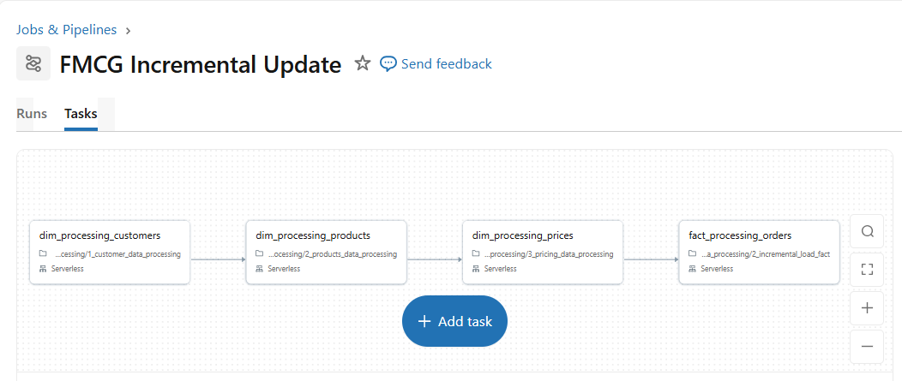

# 🚀 FMCG Data Consolidation Pipeline


Data Engineering project developed on the Databricks platform to simulate a real-world data consolidation scenario after the acquisition of a company in the FMCG — Fast-Moving Consumer Goods — sector.

The solution demonstrates the implementation of a modern Lakehouse architecture using Delta Live Tables (DLT), Unity Catalog, incremental processing, data governance, and automated orchestration.

---

# 📖 Business Context

A large FMCG company acquired a startup and needed to consolidate operational data from different systems, processes, and organizational structures.

The challenge was to build a data platform capable of:

* Integrating data from both the acquired company and the parent company.
* Ensuring governance and traceability.
* Automating historical and incremental data loads.
* Providing reliable data for corporate analytics.
* Enabling analytical queries through dashboards and natural language.

---

# 🏗️ Solution Architecture

## General Architecture


The solution was developed following Databricks Lakehouse architecture principles.

```text
AWS S3
   │
   ▼
Delta Live Tables
   │
   ▼
Bronze Layer
   │
   ▼
Silver Layer
   │
   ▼
Gold Layer (Acquired Company)
   │
   ▼
Corporate Gold Layer (Parent Company)
   │
   ▼
Dashboards + Genie AI
```

---

# 🛠️ Technology Stack

| Category        | Technology                |
| --------------- | ------------------------- |
| Platform        | Databricks Free Edition   |
| Data Lake       | AWS S3                    |
| Processing      | PySpark                   |
| Query Language  | Spark SQL                 |
| Architecture    | Medallion Architecture    |
| Governance      | Unity Catalog             |
| ETL             | Delta Live Tables (DLT)   |
| Orchestration   | Databricks Workflows      |
| Version Control | GitHub + Databricks Repos |
| Analytics       | Databricks Dashboards     |
| Generative AI   | Databricks Genie          |

---

# 🏛️ Lakehouse Architecture

## Landing Zone

Operational data is initially stored in AWS S3.

```text
s3://landing-zone
│
├── landing/
└── processed/
```

### Strategy Used

* New files are automatically identified.
* After processing, files are moved to the archive area.
* The entire process maintains full data traceability.

---

# 📚 Governance with Unity Catalog

The entire platform is governed through Unity Catalog.

## Catalog Structure

```text
fmcg
│
├── bronze
├── silver
└── gold
```

### Governance Features

* Centralized access control.
* Data lineage.
* Corporate data catalog.
* Metadata management.
* Secure data sharing.

---

# 🥉 Bronze Layer

Responsible for ingesting raw data.

### Objectives

* Preserve the original data.
* Register audit information.
* Ensure traceability.

### Added Metadata

```python
read_timestamp
file_name
file_size
```

---

# 🥈 Silver Layer

Responsible for data cleaning, standardization, and transformation.

### Customer Processing

* Information standardization.
* Null value handling.
* Duplicate removal.

### Product Processing

* Attribute normalization.
* Data type conversion.
* Inconsistency correction.

### Price Processing

* Business rule validation.
* Format standardization.
* Quality control.

---

# 🥇 Gold Layer

Provides analytics-ready data.

## Dimensional Model

### Dimensions

```text
dim_customers
dim_products
dim_gross_price
```

### Facts

```text
fact_orders
```

---

# 🏢 Corporate Consolidation Strategy

One of the main architectural decisions in this project was the separation between the acquired company domain and the parent company domain.

## Acquired Company — Child Company

```text
Bronze
   ↓
Silver
   ↓
Gold
```

## Parent Company

```text
Subsidiary Gold Data
           +
Corporate Data
           ↓
Corporate Gold Layer
```

This approach allows autonomy across data domains while enabling consolidated corporate analytics.

---

# ⚡ Delta Live Tables (DLT)

The main pipeline was implemented using Delta Live Tables.

### Benefits

* Declarative development.
* Automatic dependency management.
* Native monitoring.
* Integrated data quality.
* Reduced operational effort.

### Pipeline Flow

```text
Bronze
   ↓
Silver
   ↓
Gold
```

---

# 🔄 Load Strategy

The platform supports two types of processing.

## Historical Load — Full Load

Used during the initial platform setup.

```text
Raw Data
      ↓
Historical Load
      ↓
Gold
```

## Incremental Load

Executed daily.

```text
New Files
        ↓
Incremental Processing
        ↓
Gold Table Updates
```

### Benefits

* Lower computational cost.
* Faster processing.
* Frequent data updates.

---

# ⚙️ Orchestration

Pipeline execution is handled through Databricks Workflows.

## Incremental Pipeline



Execution flow:

```text
dim_processing_customers
           ↓
dim_processing_products
           ↓
dim_processing_prices
           ↓
fact_processing_orders
```

### Characteristics

* Explicit dependencies.
* Automated execution.
* Failure recovery.
* Centralized monitoring.
* Pre-scheduled runs.

---

# 📂 Project Structure

```text
consolidation_pipeline/
│
├── 1_setup/
│   ├── setup_catalog
│   ├── dim_delta_table_creation
│   └── utilities
│
├── 2_dimension_data_processing/
│   ├── customer_data_processing
│   ├── products_data_processing
│   └── pricing_data_processing
│
├── 3_fact_data_processing/
│   ├── full_load_fact
│   └── incremental_load_fact
│
├── docs/
│   ├── architecture.png
│   ├── workflow.png
│   └── Dashboard_AtliQon Sales Insights.pdf
│
├── AtliQon Sales Insights.lvdash.json
│
└── README.md
```

---

# 🔗 GitHub Integration

The project uses Databricks Repos directly integrated with GitHub.

### Benefits

* Version control.
* Change history.
* Preparation for CI/CD.

---

# 📊 Analytics Layer

Processed data is made available through native Databricks features.

## Databricks Dashboards

Delivery of indicators such as:

* Revenue.
* Sales volume.
* Product performance.
* Customer indicators.

## Databricks Genie

Natural language queries using Generative AI.

### Example

```text
What was the total revenue generated in the last quarter?
```

Genie automatically converts the question into SQL and returns the results.

---

# 🎯 Skills Demonstrated

This project demonstrates practical knowledge in:

* Databricks Lakehouse Platform
* Delta Live Tables (DLT)
* Unity Catalog
* Medallion Architecture
* Data Governance
* Data Lineage
* Incremental Processing
* Pipeline Orchestration
* AWS S3
* PySpark
* Spark SQL
* Analytics Engineering
* GitHub Integration

---

# 🚀 Future Improvements

* Implementation of automated data quality tests.
* GitHub Actions for CI/CD.
* Data Quality Expectations in DLT.
* Observability and monitoring.
* Pipeline SLA control.
* Expansion to multiple subsidiaries.

---

# 👩‍💻 About Me

Data Engineer specialized in data solutions using Databricks, PySpark, SQL, and AWS. I have experience in large-scale data processing, ETL pipeline development, and Lakehouse architecture, with a focus on governance, automation, and scalability.

### Contact

* LinkedIn: https://www.linkedin.com/in/manuella-melo
* GitHub: https://github.com/ManuMel0
